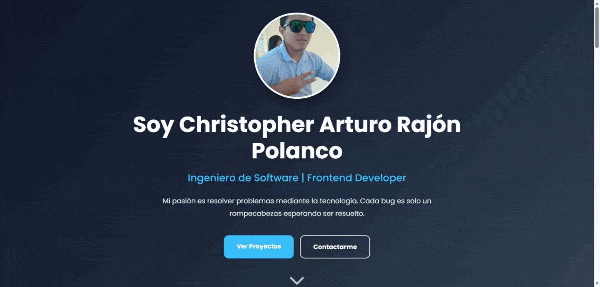

# Christopher Arturo Rajon Polanco Portfolio

Portfolio personal desarrollado con React + Vite para mostrar mis proyectos, habilidades, certificaciones y experiencia como desarrollador frontend.

---

## Preview

<p align="center">
  
</p>

---

## Tecnologías utilizadas

- React
- Vite
- Styled Components
- JavaScript
- Font Awesome
- Responsive Design

---

## Características

- Diseño moderno y responsive
- Optimizado para dispositivos móviles
- UI enfocada en experiencia de usuario
- Sección dinámica de proyectos
- Modal interactivo para certificados
- Animaciones y transiciones suaves
- Arquitectura modular con componentes reutilizables
- Integración de iconografía profesional con Font Awesome

---

## Secciones del Portfolio

- Header 
- Sobre mí
- Skills & Tecnologías
- Proyectos destacados
- Certificaciones y logros
- Contacto profesional
- Footer moderno

---

## Instalación

Clona el repositorio:

```bash
git clone https://github.com/ChrisARP12/Portafolio.git
```

Instala las dependencias:

```bash
npm install
```

Inicia el servidor de desarrollo:

```bash
npm run dev
```

---

## Build de producción

```bash
npm run build
```

---

## Demo

Próximamente desplegado.

---

## Objetivo del proyecto

Este portfolio fue desarrollado con el objetivo de mostrar mis habilidades como desarrollador frontend, mi enfoque en diseño UI/UX y mi capacidad para construir aplicaciones modernas utilizando tecnologías actuales.

---

## Autor

### Christopher Arturo Rajón Polanco

- GitHub:
  https://github.com/ChrisARP12

- LinkedIn:
  https://www.linkedin.com/in/carp-755775236/

---

## Licencia

Este proyecto es únicamente para fines de visualización personal y profesional.

No está permitido reutilizar o redistribuir el diseño completo sin autorización.
